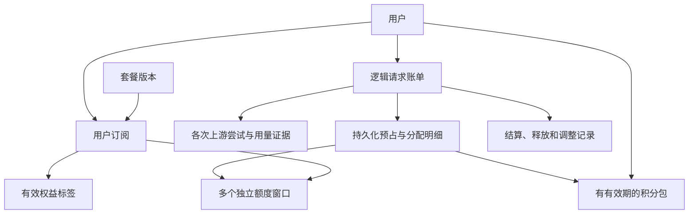

# 账户与计费设计

状态：技术设计草案。本文提出实现边界和正确性要求；它不替代[产品设计](README.md)中的已确认需求或待商榷项，也不是可直接执行的开发计划。

## 1. 设计原则

保留 New API 的转发、用户、支付和用量处理能力，在现有计费入口集中改造账户规则。按“订阅窗口”“有效期积分包”“请求结算”组织能力，让一次业务修改能在少数位置看到完整上下文；本阶段不确定文件拆分、表字段、接口路径或估算实现工时。

三种记录各司其职：订阅决定权益及使用上限；积分包提供可消耗余额；请求账单说明费用依据及实际从哪里支付。用户总余额是这些记录的汇总结果，不能继续作为有有效期积分的唯一事实来源。

套餐实收金额、请求参考计价、窗口计量和积分实际扣款分别记录。窗口沿用 New API 的费用积分和模型定价，多个模型、多个 Key 共同占用同一订阅额度；不新增 Token 或次数量纲。用户按订阅支付的请求，账单可以显示额度使用和参考价格，但不能把参考价显示为又一次现金支付。供应商成本另带自己的币种、价格依据及真实/估算/未知状态。

## 2. 核心对象与关系

| 对象 | 必须表达的信息 |
| --- | --- |
| 套餐版本 | 售价、连续有效期、额度窗口规则、标签及版本 |
| 用户订阅 | 用户、付款订单、套餐版本、有效期、状态、权益快照 |
| 订阅额度窗口 | 用户订阅、规则、窗口代次、起止时间、上限、已结算量、预占量 |
| 积分包 | 用户、来源事件、发放量、生效及到期时间、可用/预占/已消耗/已失效数量 |
| 逻辑请求账单 | 用户、唯一请求标识、计量证据、价格快照、最终费用和结算状态 |
| 上游尝试 | 所属请求、实际上游账号、结果、用量证据和上游成本 |
| 预占及分配明细 | 请求关联的窗口代次、积分包、预占量、结算量和释放量 |
| 账务变动 | 发放、扣减、释放、到期、补差等变动及其业务唯一标识 |

窗口和积分包在同一图中，不代表每次请求都同时扣两者。实际支付来源沿用 New API 的偏好与接续配置，套餐和加油包各自计时、计量，本次不新增拼单。一次套餐消费可同时计入多个限制窗口，但用户费用只算一次。

## 3. 必须保持的正确性

| 编号 | 约束 |
| --- | --- |
| I01 | 用户间的积分、窗口和账单相互隔离；同一用户订阅不因 Key 改变而获得新额度。 |
| I02 | 同一支付或发放事件只入账一次，同一请求的同一结算操作只生效一次。 |
| I03 | 新预占只能使用当时已生效、未到期且有权限使用的权益和积分。 |
| I04 | 同一用户多个并发请求不能预占同一份可用额度或积分。 |
| I05 | 适用积分包按到期时间消耗，允许跨包，结算和退款保留来源关联。 |
| I06 | 结算只调整原窗口代次；窗口重置不清除旧请求的预占、结算和审计信息。 |
| I07 | 释放未使用的预占不算新增发放，不延长原包有效期，不恢复过期权益的可用性。 |
| I08 | 真实、部分、估算、未知证据可区分；未知用量不得伪装成零用量。 |
| I09 | 用户账单与供应商成本分别记录，重试成本不自动变成用户重复扣款。 |
| I10 | 资金来源、多个窗口、API Key 额度和账单更新存在部分失败时，必须可追踪并恢复。 |
| I11 | 正常费用不得因溢出、负数、NaN、重复缓存计量而变成用户入账。调整的正负变动与普通费用分开。 |
| I12 | 订单支付、权益发放和购买退款各有防重及关联记录；请求退款不能代替现金退款，撤销不得破坏已有账务来源。 |
| I13 | 同一操作的执行者变更可验证；恢复任务和原请求竞争时，过期执行者不能提交重复结果。 |
| I14 | 核心账务、防重和核账依据不会因日志清理、订阅删除或缓存过期而丢失。 |

对每笔积分包，发放总量应可由“未分配余额 + 预占 + 净已消耗 + 已失效 + 已撤销”核对。未分配余额包含尚未生效的部分；有效期和用途筛选后的未分配余额才可消费。到期任务未登记的过期余额在查询时归入逻辑失效，不能再归入可用；登记操作只转移分量，不改变总量。若纳入冻结能力，被冻结部分仍属未分配但不可用，不能再次加入总量。

请求退还减少净已消耗，并按原来源增加未分配或失效量；撤销尚未使用的积分转入已撤销量，不能把仍待结算的预占一并清零。系统不自动返还商品购买价款或执行现金退款；管理员取消权益仍保留已消耗、预占和操作历史。超出可支付资源的费用由平台承担，独立记录未收取金额，不生成用户欠款或追扣未来充值。补偿发放形成关联的新业务事件。价格金额和额度转换遵循[现有计费规则](../../.agents/rules/billing.md)。

## 4. 订阅窗口生命周期

窗口状态依次为“未启动 → 活跃 → 结束”。每次新周期生成新的窗口代次，原窗口保留历史；不能简单把一个 `used` 字段清零后继续承接旧请求结算。

按已确认的使用时启动周期规则，首次请求需要在同一个事务中检查订阅有效性、协调所有窗口的启动，并预占本次用量。启动时先记录候选窗口；如果该请求完全失败且全额释放，若未提交上游且无其他请求使用该代次，可恢复未启动；必须检查同一代次的其他使用，不能借失败请求重置已发生的使用。

每个窗口的可用量为：上限减去已结算量和仍有效的预占量。对一次套餐消费，所有适用窗口一起检查并预占；只要一个不满足，全部不生效，不能只扣到其中一个。

旧窗口到期后，新请求按商品规则开启新代次。已在旧代次预占的请求继续关联旧代次，不能在完成时重新查“当前窗口”后扣入新周期。积分包与窗口继续完成原请求结算，不跨代次追扣；追加占用不足就停止，最终无法覆盖的费用按产品设计 §7.5 由平台承担。

首次并发请求必须共享同一个候选代次。只有该代次无其他消费或有效预占时，才可能按 D01 撤销首次失败启动；不得在一个请求失败时重置另一个请求已开始的窗口。候选预占用于并发协调，实际首次使用以提交上游的阶段确认；结算完成时间不能改变窗口起点。

多个窗口分别保存期限、上限及代次，共享费用积分计量。明确零价的调用不消耗付费额度、不启动付费窗口，仍检查用户与模型权限、保存请求记录；无限额 Key 只豁免自身额度，不能跳过账户和套餐检查。

实现契约见[开发计划 §4.15](../plans/subscription-billing.md#415-第-8-轮窗口消费契约)：购买期固定累计窗口，短窗口按首次提交上游启动；续费的新购买期在生效时采用自己的快照，提前付款不重置当前期。核账分别检查窗口预占/计量/参考量、逐请求分配及套餐累计量，多个窗口不重复增加用户计费或 Key 扣款。

## 5. 积分包预占与跨包分配

在发起上游调用前检查预计费用及支付来源。对于积分支付，以服务端时间筛选有效包，按“到期时间、发放时间、ID”依次分配并记录预占。

一次请求预占 50 分，最早到期包 A 可用 30 分、次早到期包 B 可用 100 分，分配记录为 A 30 分、B 20 分。两条预占与请求状态一起提交，任何一步失败不得留下半份扣减。

建议结算继续按原分配顺序保留最终消耗，释放多余部分。例如实际费用为 35 分，则 A 结算 30 分、B 结算 5 分并释放 15 分；实际费用为 20 分，则 A 结算 20 分、释放 10 分，B 全部释放。释放后的金额仍服从原包到期时间；包已到期时计入已失效数量，而非可用余额。

已确认：有效期内成功预占的积分可以在到期后完成原请求结算；未用部分按原来源释放，原包已到期则计入失效。

实际费用高于预占时，在同一事务中支付当时合法可用的部分；有限额 Key 同样限制追加扣款。无法收取部分由平台承担，记录参考费用、实际扣款和未收取量；不生成欠款或偿付任务，不扣成负包或负的有限额 Key。途中追加预占失败时停止继续生成；最终才可获知的用量不能伪造为零。额外补占必须再次检查当时的权益、窗口和积分包有效性，不能重新使用已到期且未预占的剩余额度。

按既有费用项舍入规则先得到本次整数费用，再分配到包；不能对每个包重复换算或舍入。分配明细之和必须等于该次预占、结算或调整总额。发放需校验数量上限、生效早于到期、来源和用途合法，不能把错误有效期自动改成长期有效。

到期任务只负责登记失效和汇总维护，消费路径自己判断时间。已预占量与尚未预占余额分别处理，不能在包到期时一并删除。上游请求状态不明时，不可仅因预占超时就自动全额退款。

### 5.1 后续调低或调高费用

多次调整按“原结算 + 已生效调整”的净结果计算，保存唯一调整 ID、证据版本和原分配，累计返还不能超过已扣量。调低时按已确认分配规则返还原包；包到期则计入失效，窗口计量回写原代次，不产生当前代次的新额度。额外补偿另发新包。

调高时区分三件事：修正原账单计价、修正原窗口实际用量、追加实际支付。旧窗口不得变成新窗口的一笔消费；已完成结算后新增确认的费用记录为平台未收取费用，不因账单更正追扣用户后续充值，也不形成用户欠款。原代次记录参考实际量和真正扣除量，不能伪造费用或扣入新窗口；新的请求仅按当前有效资源准入，不追讨平台未收取费用。

## 6. 一次请求的计费过程

1. 校验用户、模型、上游权限和所选支付来源，读取用户订阅及价格规则。
2. 建立逻辑请求账单，锁定价格和权益规则版本，校验费用数量边界。
3. 原子预占适用窗口或积分包，并处理现有 API Key 额度约束。未预占成功不发起上游。
4. 执行上游尝试，采集真实用量和可估算内容；重试复用逻辑请求及原预占，各次尝试独立记录。
5. 正常结束、中断或失败时，按证据和已确定的商品规则形成费用，并结算或释放预占。
6. 保存包分配、窗口代次、用户费用、上游成本及结果。持久化失败的请求保持待处理状态，可重试恢复。
7. 若后续取得可信用量，产生单独补差操作；记录原账单、调整额及依据，不覆写原始用量。

价格快照需要包含模型和适用的缓存/工具等价格规则；仅固定一个总价数字不足以解释账单。如果重试换到其他平台，上游成本使用该次尝试的实际成本规则，用户收费是否变化由商品规则决定。

预占是金额和额度的占用，不代表费用已经被证实。结算操作采用业务唯一标识持久化防重；单进程互斥锁或内存中的 `settled` 标志不能替代进程恢复后的防重复机制。

新账本不得沿用“大余额即跳过钱包预占”的旁路。余额仍可能在并发调用中被占用或即时到期。本次明确不提供授信和用户欠款。零费用请求可以不占金额，但仍要有请求记录及适用权益检查。

## 7. 用量证据与中断

每个计费项目保存数量及来源，例如输入来自回执、输出来自文本估算、缓存为未知；请求整体状态只能作为汇总，不能掩盖字段间差异。

| 证据情况 | 技术处理 |
| --- | --- |
| 完整有效回执 | 按协议语义归一化，区分缓存读取、缓存写入、普通输入及输出 |
| 只有开始阶段输入/缓存回执 | 保留已知字段，只估算缺少的输出，不覆盖整份用量 |
| 仅观察到输出增量 | 保留接收内容对应的估算及覆盖范围，不声称包含上游全部生成量 |
| 没有回执也没有可观察内容 | 标为未知，按 D05、D10 的收费或退款规则进入结算/待处理 |
| 原始回执非法或自相矛盾 | 保留证据、阻止不安全计算，进入异常处理而非盲目扣费 |
| 可查询后续真实用量 | 针对支持的上游做补查；不假设所有供应商都支持此能力 |

New API 当前在客户端断开时关闭上游流，可作为停止生成策略的基础。继续读取回执会增加停止后的供应商消费，不得为了获得准确回执而默认悄悄改成继续生成；负责人指定沿用此行为。

客户已经停止接收、网关已经关闭连接、供应商已经停止生成，是三个不同事件。网关只能准确记录自己观察到的事实，不保证供应商同时停止计费。账单需要能说明这一差异。

文本以外的图片、音频、视频及工具费用继续遵守对应适配器和现有计费规则，不能统一套用“按已收到文本估算”。产品协议范围和各模型价格在开发计划中明确。

### 7.1 回执归并与重试边界

每份证据记录尝试序号、协议事件标识或可用序号、采集阶段和覆盖范围。区分增量与累计计数，重复累计回执不能相加；乱序较早回执不能覆盖较晚完整结果，矛盾结果进入核查。协议转换前后均指向同一计量事实，不能分别扣一次。

估算记录算法/分词器版本及价格表达式版本，以便重算和解释。原始证据保留必要用量片段，不默认存整段对话、请求正文或密钥。不同币种金额不能直接相加；涉及换算时锁定币种、换算依据和舍入方式。沿用 New API 的币种与额度换算配置，未配置的非兼容币种不能擅自默认为 1:1。

上游提交之前、提交后无结果、已收到响应但未转发、客户端已收到输出分别记录。客户端已收到内容后停止整次自动重放；提交后无结果的尝试标为执行结果不确定。仅在供应商明确支持且经验证时使用上游幂等标识，不能把本地账务幂等当作上游只执行一次的保证。

## 8. 失败恢复与一致性

数据库保存订阅、窗口、积分包、预占及账务状态，Redis 可加速读取和并发协调，但不能丢失可重建的账务依据。一次请求的结算不与外部上游调用放在同一个长事务中。

并发实现需遵循项目的 SQLite、MySQL、PostgreSQL 兼容要求；不能只依靠 SQLite 不支持的行锁语法。必须有可验证的条件更新或事务方案，按稳定顺序处理同一用户的多包分配，避免超扣及锁顺序冲突。

对“费用已更新但 Key 额度或账单写入失败”等情况，保存已成功的阶段和未完成的阶段，恢复时只执行尚未完成的操作。退款亦如此，不能因为某一步失败就重新整笔退款。

补查、超时恢复和人工调整共用防重账务入口。操作审计保留触发来源、关联请求、原因和变化量；日志不记录供应商凭证、用户 API Key 或完整敏感请求内容。

### 8.1 状态转换与恢复资格

| 当前阶段 | 可发生的下一步 | 处理约束 |
| --- | --- | --- |
| 已创建、未预占 | 原子预占或本地拒绝 | 预占失败时没有上游调用；唯一操作与分配一起提交 |
| 已预占、尚未提交 | 开始上游尝试或有证据地释放 | 先持久化尝试和执行资格；数据库提交结果不明时先查防重记录，不再盲扣 |
| 执行中 | 保存结束证据、进入待结算，或标记待核查 | 执行超时与恢复接管不证明上游停止；不直接全退 |
| 待结算/待释放 | 完成相关账务及待办步骤 | 结算和释放互斥；释放不再是已结算请求的合法终结操作 |
| 已结算 | 写入新的费用调整或商品撤销关联 | 不重做原结算；保持原证据和分配 |
| 已释放 | 保持历史，或按明确规则新增调整 | 迟到回执不能重新使用原预占，应按调整规则处理 |
| 待核查 | 有新证据或人工决定后转入结算/释放/调整 | 保存核查原因、负责人和结果，不凭定时任务猜测结果 |

恢复资格使用持久化所有者、租约到期时间和递增执行代次。接管者以条件更新取得新代次，所有后续写入都验证当前代次，原执行者迟到后不能提交旧结果。租约只是防止内部工作重复，不能停止供应商执行。

恢复扫描、到期登记、补查和核账分工明确，均支持分页、重试和多实例竞争。调度时间、重试上限、核查时限作为运营配置；达到上限后进入可见待处理状态并通知管理员，不能无限静默重试。保存待处理金额、最早未完成时间、恢复失败和核账差异等运行指标。

### 8.2 记录保留与权限

账本及防重记录不能照搬旧预扣记录按几天直接删除的清理规则。按支付通知重放、请求补差、任务生命周期及审计要求定义保留期；明细归档后仍保留必要唯一业务键与结果摘要，使旧事件不能再发放或扣款。

用户查询只返回自己的扣款、窗口和公开权益；管理员才查询供应商成本、内部账号和调整审计。标签查询同时返回订阅有效状态、版本、失效时间和服务端时间；缓存寿命不得超过权益失效时间，主动终止需要失效或重新校验。按各份有效订阅返回标签与版本，不自动合并同名标签为新权限。暂不新增外部系统写入资源权限的接口。

### 8.3 商品订单与权益撤销

支付订单先记录锁定的商品版本、金额及币种；验证到账金额、订单状态和支付事实后，再按稳定订单业务 ID 发放权益。不能仅根据客户端宣称支付成功开通。金额不符、重复或乱序支付/撤销事件需保存核查状态。

付款事实与权益开通分别记录。付款时刻需要可核实的渠道依据，回调到达时刻、结账页创建时刻均不能替代；金额、币种、付款人或付款时刻缺失时保留未知并核查，不从订单反推“已经到账”。同一渠道的一个实际交易只能归属一张本地订单，换通知编号也不能重复发放。同一通知内容发生矛盾时，追加关联原回执的观察和核查状态，原付款证据不被覆盖；重复矛盾也不能重复生成核查依据。后来的正常通知不自动抹去之前的矛盾。这是 R06 的付款起算和收支核实约束；续费顺延、购买快照和管理员取消遵循产品设计 §7.7 的已确认答复，不自动退款。

外部结账创建和本地订单防重分别处理。渠道有明确、持续有效的创建防重协议时按原订单标识重试；没有时，先提交一次发起状态，再发送创建请求。成功响应保存后重放原链接；已发送但结果不明或进程中断时进入核查，不能把追踪用的 request_id 当成渠道防重承诺。发起前的商品读取失败尚未产生收款请求，允许重试。明确不兼容的币种、计价精度、税费或自动扣款商品在发起前拒绝，不通过“先让用户付钱，再修改合同”处理。

现金购买套餐、充值、余额购买套餐分别记录。余额购买套餐的包扣款、订单和订阅创建应在同一主数据库事务完成；失败全部回滚。购买失败回滚原分配，已完成购买不自动退款；请求费用修正仍按原来源处理。

管理员取消权益先停止新使用并失效标签；已取得的预占继续按原请求处理，订单、付款、权益版本和取消人/原因保留。现金退款不在系统内执行，管理员在外部自行处理。已有人工核查记录仅保留来源与操作依据，不作为自动返款或自动补发的入口。

同套餐续费以 `max(核实付款时间, 当前连续订阅结束时间)` 接续新购期限。按购买形成可追溯的期限段，各段保留自己的版本及标签；展示连续到期时间，不让提前续费重置当前窗口或消费未来月份额度。不同套餐沿用多订阅，不自动升级换档。

### 8.4 付款核查的技术边界

付款事实不完整或矛盾时，只保存可证实的字段，不发放新权益。管理员可凭外部凭证补齐准确金额、币种、交易和付款时刻；授权、最新事实边界、交易归属、防重、追加事实和开通必须一并验证。原供应商事实不可改写，管理员证据与操作单独保留。独立取消时间边界优先于后来付款或核查，不能借补单恢复已取消权益。核查不执行系统现金退款，不产生用户欠款。具体接口与数据契约见开发计划 §4.14；缺陷记录另见归档 bug 文档。

## 9. 现有入口与迁移

| 现有入口 | 复用或改造方向 |
| --- | --- |
| [渠道选择](../../service/channel_select.go)及[渠道账号配置](../../model/channel.go) | 保留路由能力，验证多 Key 渠道是否破坏账号级固定 |
| [订阅模型](../../model/subscription.go) | 复用订单和有效订阅，增加窗口规则、代次及版本，不沿用单一清零计数实现多窗口 |
| [资金来源](../../service/funding_source.go) | 将钱包扣减接到积分包分配，将订阅扣减接到多个窗口的联合预占 |
| [计费会话](../../service/billing_session.go) | 继续作为请求生命周期入口，补持久化防重和失败恢复，处理资金与 Key 额度的分步提交 |
| [充值](../../model/topup.go)、[兑换](../../model/redemption.go) | 统一通过积分包发放入口入账，并保留支付/来源唯一标识 |
| [文本费用结算](../../service/text_quota.go)、[用量依据](../../service/billing_usage.go) | 复用归一化与计价，把估算标记扩展到各个计费项目，并记录可追踪调整 |

不新增绕过这些入口的直接 `user.quota += N` 或独立扣费路径。签到、管理员赠送、其他奖励和退款补偿也必须通过统一发放/变动入口；实施前盘点所有现有钱包写入点。

本项目尚无真实用户和历史余额，交付按新部署、新账户进行，不开发旧余额逐包重建、旧欠款导入或用户灰度迁移产品。旧入口对新账户的防旁路约束保留。数据库结构仍验证新建、重复启动及项目要求的上游发布版本升级，不能把无历史用户需求理解为免除数据库兼容验证。

路由绑定记录稳定内部账号 ID 和凭证版本，不用凭证在多 Key 数组的位置做身份。账号删除、轮换或渠道重排后，严格固定模式不自动改绑到另一账号；会话优先模式按 D11 切换并留痕。会话绑定键必须至少隔离用户及允许的路由范围。

## 10. 实施前验证要求

先为 [A01–A24 验收标准](README.md#11-验收标准)建立能暴露当前缺口的行为测试，再实现；不能为了让测试变绿而把待商榷策略当作已确认需求。

重点验证跨包扣减、多个窗口联合预占、窗口首次失败、并发启动、重复付款通知、跨周期结算、退款遇到已到期包、价格变更、断流和进程恢复。新包账务必须覆盖 SQLite、MySQL、PostgreSQL 的真实数据库，以及旧数据升级和重复启动。

现有参考测试包括[用量累积测试](../../service/responses_usage_test.go)、[额度预占测试](../../model/quota_reserve_test.go)、[订阅重置测试](../../model/subscription_reset_test.go)及[客户端断开测试](../../relay/helper/stream_scanner_test.go)。这些测试保护现有局部行为，不代表新设计已经实现或全部通过验证。

实现步骤、文件边界、数据迁移和实际测试命令见[开发计划](../plans/subscription-billing.md)，具体输入与故障断点见[验收与故障场景](../plans/accounting-verification.md)。每阶段动工前定稿其依赖的接口、状态及约束，不能把概念设计直接当成已验证实现。
